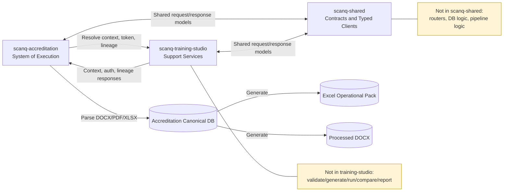

# Integration Proposal: scanq-training-studio ↔ scanq-accreditation

**Date**: June 15, 2026  
**Scope**: Architectural strategy for sharing code and test data between two Python services  
**Final Decision**: Option E (Hybrid) with strict ownership boundaries

---

## Executive Summary

**scanq-training-studio** (Archanaut Academy) and **scanq-accreditation** serve complementary but distinct purposes:

- **Training Studio**: Continuous media generation service (FastAPI + async workers, providers, database)
- **Accreditation**: Periodic CLI testing pipeline (lightweight, opinionated, Jira-integrated)

**Final Decision**: **Hybrid approach with strict ownership boundaries**:
1. **Tier 1 (Immediate)**: Create a shared Python SDK package (`scanq-shared`) for contracts, enums, and typed clients only
2. **Tier 2 (Short-term)**: Keep accreditation parsing/execution in `scanq-accreditation`; add a canonical DB-backed data model there
3. **Tier 3 (Medium-term)**: Add thin support endpoints in `scanq-training-studio` for context/auth/lineage only

---

## Boundary Definition (Authoritative)

### scanq-accreditation (System of Execution)
- Owns all accreditation workflows: `validate`, `generate`, `run`, `compare`, `evidence`, `report`, `jira-sync`
- Owns ingestion/normalization of DOCX/PDF/XLSX into canonical records
- Owns local accreditation database schema and release/version lifecycle for test packs
- Owns Excel generation and processed DOCX generation from canonical records

### scanq-training-studio (Support Services)
- Owns project/environment/actor resolution
- Owns issuance of short-lived service/session auth artifacts
- Owns lineage registration/finalization for cross-system audit trails
- Optionally owns media enrichment for evidence (non-blocking)

### scanq-shared (No Runtime Logic)
- Owns request/response models, shared enums, error schemas, and typed HTTP clients
- Does **not** contain FastAPI routes, DB persistence, or accreditation pipeline business logic

## Boundary Diagram (One-Page View)



---

## Current Architecture Analysis

### scanq-training-studio
| Aspect | Details |
|--------|---------|
| **Purpose** | Video generation for training content at scale |
| **Architecture** | FastAPI service + async workers + Provider adapters + Database |
| **Key Components** | Projects API, Actor credential mgmt, Playwright recorder, Media providers (HeyGen, ElevenLabs, OpenAI, Anthropic, NVIDIA NIM) |
| **Deployment** | Docker containers + GCS (media), PostgreSQL (lineage) |
| **Dependencies** | Heavy (FastAPI, SQLAlchemy, Playwright, cryptography, cloud SDK) |
| **State** | Recently completed Phase 1: hybrid recorder mode, project-scoped actors, supervisor checks |

### scanq-accreditation
| Aspect | Details |
|--------|---------|
| **Purpose** | Automated NatHERS accreditation testing and evidence packaging |
| **Architecture** | CLI tool with structured pipeline stages |
| **Key Components** | Validate, Generate, Run, Compare, Evidence, Report, Jira/Confluence sync |
| **Deployment** | Local CLI or CI/CD (GitHub Actions) |
| **Dependencies** | Lightweight (Click, Pydantic, httpx, openpyxl) |
| **State** | Scaffolded; dwelling configs in place; CLI structure ready |

### Available Test Inputs
Located: `/home/david/Archanaut/Dev/scanq_root/Accreditation Testing/`

| Input Type | Files | Reusability |
|------------|-------|------------|
| **Floor Plans (PDF)** | `20250113 NatHERS UIP Test Dwelling 101 - Floor Plan.pdf` | Per dwelling; manual/auto tracing needed |
| **Specifications (PDF)** | `20250113 UIP Test Dwelling 101 Specification Document.pdf` | Per dwelling; thermal + WoH specs |
| **Test Scenarios (XLSX)** | `UIP Test Dwellings - Thermal and WoH Specs.xlsx` | Multi-row; multiple dwellings + variants |
| **Audit Checklist (XLSX)** | `Audit Checklist 22052026 - Template.xlsx` | Template; row-per-test |
| **Collaborative Tools (DOCX)** | `Collaborative tool testing.docx` | Free-form; needs extraction/structuring |

**Current Challenge**: Test inputs are static files; no programmatic ingestion framework yet.

---

## Integration Options Analysis

### Option A: Git Submodule

**Approach**: Add `scanq-training-studio` as a submodule of `scanq-accreditation`

| Pros | Cons |
|------|------|
| Full source access; cherry-pick training-studio APIs | Heavy; accreditation CLI would carry entire FastAPI service |
| Version pinning at specific commit | Complicates CI/CD; two separate deployment workflows |
| | Training-studio changes force accreditation rebuild |

**Verdict**: ❌ **Not recommended** — Accreditation is lightweight; submodule adds unnecessary complexity.

---

### Option B: Sparse Checkout

**Approach**: Clone only specific directories from training-studio (e.g., `src/api/schemas/`, `src/services/`)

| Pros | Cons |
|------|------|
| Reduces cloned footprint | Breaks CI/CD automation (manual setup per dev) |
| Explicit dependency on specific code | No dependency tracking; can diverge silently |
| Avoids full FastAPI import in accreditation | Not idiomatic for Python package management |

**Verdict**: ⚠️ **Possible but not ideal** — Breaks reproducibility. Better to publish as package.

---

### Option C: Shared Python SDK Package

**Approach**: Extract shared schemas, models, and utilities into a standalone PyPI package (`scanq-shared`)

| Pros | Cons |
|------|------|
| Versioned, reproducible dependencies | Requires publishing pipeline (PyPI or private repo) |
| Clean imports: `from scanq_shared import ProjectModel` | Maintenance overhead for shared code |
| Both repos depend on released version | Migration path if schemas change |
| Enables third-party integrations | Slight duplication if both repos have wrapper schemas |

**Verdict**: ✅ **Recommended for Phase 1** — Clean separation of concerns; standard Python packaging.

---

### Option D: API-First Integration

**Approach**: Accreditation CLI calls training-studio HTTP API for certain workflows (generate drafts, manage dwellings, fetch evidence)

| Pros | Cons |
|------|------|
| Decouples repos completely | Network latency; adds failure modes |
| Training-studio changes transparent to accreditation | Requires running training-studio service |
| Enables federated workflows (multi-service orchestration) | Not ideal for offline/batch CI/CD |

**Verdict**: ✅ **Recommended for Phase 2+** — Enables advanced workflows after Phase 1 stabilizes.

---

### Option E: Hybrid (Final Decision)

**Approach**: Combine C (SDK) + D (API) with strict separation of duties

1. **Phase 1 (Now)**: SDK with shared contracts and typed clients (`scanq-shared` package)
2. **Phase 2 (4-6 weeks)**: Build canonical accreditation data layer + DOCX/Excel outputs in `scanq-accreditation`
3. **Phase 3 (Future)**: Add thin support endpoints in `scanq-training-studio` for context/auth/lineage

---

## Recommended Implementation Plan

### Phase 1: Create Shared SDK (`scanq-shared`)

**Duration**: 1-2 days  
**What to Extract**:

```
scanq-shared/
├── src/scanq_shared/
│   ├── models/
│   │   ├── project.py          # ProjectResponse, ProjectEnvironmentResponse
│   │   ├── job.py              # JobResponse, JobStatusEnum
│   │   ├── intake.py           # IntakeDraftResponse, AttachmentMetadata
│   │   ├── dwelling.py         # DwellingConfig, ExpectedOutputs (NEW)
│   │   └── provider.py         # ProviderProfile, CostEstimate
│   ├── schemas/
│   │   ├── auth.py             # DevLoginRequest, ServiceTokenResponse
│   │   ├── project.py          # ProjectCreateRequest
│   │   ├── intake.py           # IntakeDraftRequest, GenerateDraftRequest
│   │   └── dwelling.py         # DwellingSpecRequest (NEW)
│   ├── types/
│   │   ├── common.py           # UUID, datetime, enums
│   │   └── lineage.py          # ArtifactManifest, ExecutionContext
│   ├── clients/
│   │   └── training_studio.py  # Typed client for thin support endpoints
│   ├── utils/
│   │   └── http.py             # Shared httpx retry/error patterns
│   └── __init__.py
├── tests/
├── pyproject.toml              # Minimal deps: pydantic, typing-extensions
└── README.md
```

**Key Files to Extract**:
- ✅ From training-studio `src/api/schemas/project.py` → `scanq-shared/schemas/project.py`
- ✅ From training-studio `src/api/schemas/intake.py` → `scanq-shared/schemas/intake.py`
- ✅ From training-studio `src/api/schemas/auth.py` → `scanq-shared/schemas/auth.py`
- ✅ From training-studio `src/models/project.py` → `scanq-shared/models/project.py`
- ✅ Create new: `scanq-shared/models/dwelling.py` (shared accreditation dwelling model)

**Publishing**:
- Option 1: Private PyPI (Artifact Registry or GitHub Packages)
- Option 2: Local `file://` path in `pyproject.toml` during development
- Option 3: Git+SSH reference in `pyproject.toml` (if repo published on GitHub)

**Example `pyproject.toml` usage in both repos**:
```toml
dependencies = [
  "scanq-shared @ git+ssh://git@github.com:archanaut/scanq-shared.git@main",
]
```

---

### Phase 2: Accreditation Data & Document Management (`scanq-accreditation`)

**Duration**: 3-5 days  
**What to Build**:

#### 2a. Canonical Accreditation Model + DB

```python
# scanq-accreditation/src/domain/models.py

class PackVersion:
    """Accreditation release version and source hash."""
    pack_version: str
    source_doc_hash: str

class TestCase:
    """Canonical test case persisted in accreditation DB."""
    case_id: str
    dwelling_id: str
    scenario_id: str
    requirement_id: str
    expected_result: str

class DocumentProcessor:
    """Parse DOCX once, normalize, persist, and generate outputs."""
    async def import_docx(self, path: str) -> PackVersion
    async def export_excel(self, pack_version: str) -> str
    async def export_processed_docx(self, pack_version: str) -> str
```

#### 2b. Spreadsheet/PDF/DOCX Parsing

```python
# In accreditation: src/testdata/spreadsheet_parser.py, src/testdata/document_parser.py

class SpreadsheetParser:
    """Parse UIP Test Dwellings XLSX into DwellingInput objects."""
    async def parse_row(
        self, 
        file_path: str, 
        row_idx: int,
        pdf_storage_root: str  # e.g., "/Accreditation Testing/"
    ) -> DwellingInput
    
    async def parse_all_rows(
        self,
        file_path: str,
        pdf_storage_root: str
    ) -> list[DwellingInput]
```

#### 2c. Outputs from Canonical Data

**Usage in Accreditation**:
```python
# scanq-accreditation/src/cli.py extended

@main.command()
@click.argument("dwelling_id")
@click.option("--source-docx", required=True)
def import_pack(source_docx: str) -> None:
    """Parse DOCX into canonical DB model and create first release."""
    version = asyncio.run(document_processor.import_docx(source_docx))
    log.info("pack_imported", pack_version=version.pack_version)

@main.command()
@click.option("--pack-version", required=True)
def export_pack(pack_version: str) -> None:
    """Generate Excel and processed DOCX from canonical records."""
    xlsx = asyncio.run(document_processor.export_excel(pack_version))
    docx = asyncio.run(document_processor.export_processed_docx(pack_version))
    log.info("pack_exported", excel=xlsx, processed_docx=docx)
```

---

### Phase 3: Training-Studio Support Endpoints (Medium-term)

**Duration**: 5-7 days  
**New Endpoints**:

```
POST   /api/v1/accreditation/context/resolve                # Resolve project/environment/actor context
POST   /api/v1/accreditation/auth/service-token             # Issue short-lived auth artifact
POST   /api/v1/accreditation/lineage/register               # Register run lineage
POST   /api/v1/accreditation/lineage/{lineage_id}/finalize # Finalize lineage outcome
POST   /api/v1/accreditation/media/compose-evidence         # Optional media enrichment
```

**Benefits**:
- Accreditation CLI keeps full control of test execution while reusing trusted context/auth services
- Reduces duplication of actor/environment resolution and token handling
- Centralizes lineage without moving accreditation business logic

---

## Test Data Organization Strategy

### Current State
```
../scanq_root/Accreditation Testing/
├── 20250113 NatHERS UIP Test Dwelling 101 - Floor Plan.pdf
├── 20250113 UIP Test Dwelling 101 Specification Document.pdf
├── UIP Test Dwellings - Thermal and WoH Specs.xlsx
├── Audit Checklist 22052026 - Template.xlsx
└── Collaborative tool testing.docx
```

### Proposed Structure (with Accreditation Project Integration)

```
scanq-accreditation/
├── data/                                  # Test data root
│   ├── sources/                           # Raw input files
│   │   ├── floor_plans/
│   │   │   └── dwelling_101.pdf
│   │   ├── specifications/
│   │   │   └── dwelling_101_spec.pdf
│   │   └── scenarios.xlsx                 # UIP Test Dwellings spreadsheet
│   │
│   ├── dwellings/                         # Per-dwelling working directories
│   │   ├── dwelling_101/
│   │   │   ├── config.yaml                # Structured config from spreadsheet
│   │   │   ├── inputs/                    # Generated ScanQ inputs
│   │   │   ├── outputs/                   # ScanQ API responses (JSON)
│   │   │   ├── comparison/                # Diff results
│   │   │   └── evidence/                  # Markdown + Jira artifacts
│   │   └── dwelling_102/
│   │       └── ...
│   │
│   └── fixtures/                          # Test fixtures for CI/CD
│       ├── minimal_dwelling.yaml
│       └── sample_scanq_output.json

.env.example
├── ACCREDITATION_DATA_ROOT=./data
├── ACCREDITATION_SOURCES_ROOT=../scanq_root/Accreditation Testing
├── SCANQ_STAGING_URL=http://localhost:8000
└── SCANQ_SERVICE_JWT=<token>
```

### Data Import Script

```python
# scripts/import_test_data.py
"""
One-time import to organize test data from 
../scanq_root/Accreditation Testing/ into scanq-accreditation/data/
"""

async def import_from_legacy_location():
    """
    1. Copy PDFs from ../scanq_root/ to data/sources/
    2. Parse UIP Test Dwellings.xlsx
    3. Generate config.yaml for each dwelling
    4. Populate dwellings/{id}/ directories
    """
```

---

## Implementation Roadmap

### Week 1: Phase 1 (SDK)
- [ ] Create `scanq-shared` repo
- [ ] Extract schemas from training-studio
- [ ] Extract models from training-studio
- [ ] Create dwelling model + enums
- [ ] Publish to private registry (or git+ssh)
- [ ] Update training-studio to import from `scanq-shared`
- [ ] Update accreditation to import from `scanq-shared`

### Week 2: Phase 2 (Accreditation Data Layer)
- [ ] Implement `SpreadsheetParser` (openpyxl-based XLSX parsing)
- [ ] Implement `DocumentParser` (PDF/DOCX extraction)
- [ ] Add canonical DB schema (`pack_version`, `requirement`, `test_case`, `test_step`, `decision_log`, `evidence_ref`)
- [ ] Create `scripts/import_test_data.py` to ingest legacy PDFs
- [ ] Add CLI commands: `import-pack`, `export-pack`, `validate-pack`, `diff-pack`
- [ ] Update accreditation GitHub Actions to skip PDF download (assume local copy)

### Week 3-4: Phase 3 (Support Endpoints) — *Optional, depends on priorities*
- [ ] Add thin support endpoints to training-studio (`context`, `auth`, `lineage`)
- [ ] Connect accreditation CLI to training-studio typed client
- [ ] Document API contracts in integration-guide.md

---

## Decision Matrix

| Criterion | SDK | API | Submodule | Sparse | Hybrid |
|-----------|-----|-----|-----------|--------|--------|
| **Deployment Independence** | ✅ High | ✅ High | ❌ Low | ✅ High | ✅ High |
| **CI/CD Simplicity** | ✅ Simple | ⚠️ Requires SVC | ❌ Complex | ❌ Manual | ⚠️ Mixed |
| **Phase 1 Feasibility** | ✅ Quick | ❌ Slow | ❌ Heavy | ⚠️ Fragile | ✅ Quick |
| **Code Reuse** | ✅ Good | ✅ Good | ✅ Full | ❌ Fragile | ✅ Excellent |
| **Maintenance** | ✅ Moderate | ✅ Moderate | ❌ High | ❌ High | ⚠️ Moderate |
| **Third-Party Extensibility** | ✅ Yes | ✅ Yes | ❌ No | ❌ No | ✅ Yes |

**Final Decision**: Hybrid (SDK + API phased) ✅

---

## Concrete Next Steps

### Immediate (This Week)
1. **Decision**: Option E confirmed; execute Hybrid plan (SDK Phase 1 + Support API Phase 3)
2. **Create**: `scanq-shared` repo with initial schemas extracted
3. **Update**: Both training-studio and accreditation to depend on `scanq-shared`
4. **Test**: Verify imports work in both repos

### Short-term (Next 1-2 Weeks)
5. **Implement**: Test data management layer (SpreadsheetParser, DocumentValidator)
6. **Migrate**: Legacy test inputs from `../scanq_root/Accreditation Testing/` to `scanq-accreditation/data/`
7. **Document**: Data structures and ingestion workflows in accreditation README

### Medium-term (Weeks 3-4, Optional)
8. **Extend**: Training-studio with support-only accreditation endpoints
9. **Integrate**: Accreditation CLI to call training-studio for context/auth/lineage
10. **Demo**: End-to-end accreditation execution + lineage registration workflow

---

## Open Implementation Choices

1. **SDK Publishing**: Use GitHub Packages, Artifact Registry, or local `file://` path?
2. **Test Data Ownership**: Keep canonical accreditation DB model in `scanq-accreditation` and keep `scanq-shared` lightweight?
3. **Accreditation Scheduling**: Phase 3 API — is periodic batch accreditation (weekly/monthly) a priority?
4. **Evidence Video**: Is optional media enrichment in scope for Phase 3, or deferred?
5. **Multi-dwelling Workflows**: Should accreditation support parallel execution of multiple dwellings?

---

## Appendix: Shared Code Inventory

### Training-Studio Code Ready to Extract

```
✅ src/api/schemas/project.py
✅ src/api/schemas/intake.py
✅ src/api/schemas/auth.py
✅ src/models/project.py
✅ src/models/job.py
✅ src/models/manifest.py
✅ src/api/schemas/profile.py
✅ src/orchestration/contracts (enum/config classes)
```

### Accreditation Code Ready to Share

```
📋 src/compare/diff.py         → diff algorithms, DiffResult model
📋 src/evidence/packager.py    → evidence templating (can be reused for training-studio)
📋 src/integrations/jira_client.py → Jira integration patterns (could be shared)
```

### New Shared Code to Create (Contracts Only)

```
🆕 scanq-shared/models/dwelling.py
🆕 scanq-shared/schemas/dwelling.py
🆕 scanq-shared/types/lineage.py (enhanced)
🆕 scanq-shared/clients/training_studio.py (typed client)
```

---

**Document Version**: 1.0  
**Last Updated**: June 15, 2026  
**Status**: Final Decision Recorded (Option E); ready for execution
