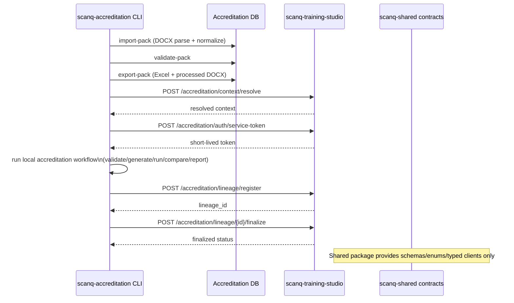
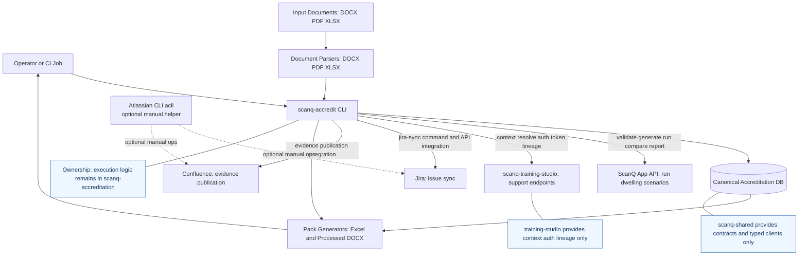

# Integration Technical Deep Dive

**Companion to**: INTEGRATION_PROPOSAL.md  
**Focus**: Code patterns, migration steps, and concrete examples
**Decision Baseline**: Option E (Hybrid) is finalized

---

## Part 1: Creating `scanq-shared` — Step-by-Step

## Boundary Rules (Read First)

- `scanq-accreditation` owns accreditation execution logic and canonical accreditation data persistence.
- `scanq-training-studio` exposes only support endpoints for context, auth, and lineage.
- `scanq-shared` contains contracts, enums, and typed clients only; no routers, no DB logic, no pipeline logic.

## Boundary Diagram (Implementation View)



## Accreditation CLI Integration Architecture (End-to-End)

The orchestration entrypoint is the ScanQ accreditation CLI (`scanq-accredit`). Atlassian CLI (`acli`) is optional for manual Jira/Confluence admin workflows and is not the primary execution path.



### Integration Interfaces

| Integration | Driven By | Purpose |
|---|---|---|
| ScanQ App API | `scanq-accredit` | Execute accreditation scenarios and collect outputs |
| training-studio support API | `scanq-accredit` | Resolve project/environment/actor context, issue auth artifacts, register/finalize lineage |
| Jira | `scanq-accredit` (`jira-sync`) | Sync defects and progress issues |
| Confluence | `scanq-accredit` integration module | Publish evidence summaries and traceability output |
| Atlassian CLI (`acli`) | Optional manual operator workflow | Ad-hoc Jira/Confluence admin tasks outside main pipeline |
| Excel and processed DOCX outputs | `scanq-accredit` + canonical DB | Keep operational and reviewer artifacts in lock-step |

### Current `scanq-accredit` Command Surface

- `uv run scanq-accredit validate <dwelling_id>`
- `uv run scanq-accredit generate <dwelling_id>`
- `uv run scanq-accredit run <dwelling_id>`
- `uv run scanq-accredit compare <dwelling_id>`
- `uv run scanq-accredit evidence <dwelling_id>`
- `uv run scanq-accredit report`
- `uv run scanq-accredit jira-sync <dwelling_id>`
- `uv run scanq-accredit confluence-sync <dwelling_id>`

### Planned Extensions (Boundary-Compatible)

- `uv run scanq-accredit import-pack --source-docx <path>`
- `uv run scanq-accredit validate-pack --pack-version <vX.Y>`
- `uv run scanq-accredit export-pack --pack-version <vX.Y>`
- `uv run scanq-accredit confluence-publish --pack-version <vX.Y>`

### Step 1: Initialize Repository

```bash
# Create new repo
cd /home/david/Archanaut/Dev
git init scanq-shared
cd scanq-shared

# Copy minimal project structure
cat > pyproject.toml << 'EOF'
[project]
name = "scanq-shared"
version = "0.1.0"
description = "Shared models, schemas, and utilities for ScanQ ecosystem"
requires-python = ">=3.14"
dependencies = [
  "pydantic>=2.9.2",
  "typing-extensions>=4.10.0",
]

[dependency-groups]
dev = [
  "mypy>=1.11.2",
  "pytest>=8.3.3",
  "ruff>=0.6.9",
]

[build-system]
requires = ["hatchling>=1.25.0"]
build-backend = "hatchling.build"

[tool.uv]
package = false
EOF

mkdir -p src/scanq_shared tests
touch src/scanq_shared/__init__.py
git add . && git commit -m "Initial: scanq-shared project structure"
```

### Step 2: Extract Models from Training-Studio

**Before** (`src/api/schemas/project.py` in training-studio):
```python
# Scattered across training-studio

# In src/api/schemas/project.py
class ProjectCreateRequest(BaseModel):
    name: str
    repo_url: str | None = None
    # ...

# In src/models/project.py
class Project(Base):
    __tablename__ = "projects"
    # SQLAlchemy ORM model

# In multiple places: error handling, types, etc.
```

**After** (organized in `scanq-shared`):
```
scanq-shared/src/scanq_shared/
├── models/
│   ├── __init__.py
│   ├── project.py      # ProjectResponse, ProjectEnvironmentResponse
│   ├── job.py          # JobResponse, JobStatusEnum
│   ├── intake.py       # IntakeDraftResponse
│   └── dwelling.py     # NEW: DwellingInput, DwellingValidator
├── schemas/
│   ├── __init__.py
│   ├── project.py      # ProjectCreateRequest, ProjectUpdateRequest
│   ├── intake.py       # IntakeDraftRequest, GenerateDraftRequest
│   └── dwelling.py     # NEW: DwellingSpecRequest
└── types/
    ├── __init__.py
    ├── common.py       # Enums, type aliases
    └── lineage.py      # ArtifactManifest, ExecutionContext
```

**Migration code** (`scanq-shared/src/scanq_shared/models/project.py`):
```python
"""
Project models — extracted from training-studio src/models/project.py
with ORM dependencies removed (kept as Pydantic BaseModel for shared schemas).
"""

from datetime import datetime
from uuid import UUID

from pydantic import BaseModel, Field


class ProjectResponse(BaseModel):
    """Project in API responses (no ORM)."""
    project_id: UUID
    name: str
    repo_url: str | None = None
    default_branch: str = Field(default="main")
    latest_commit_sha: str | None = None
    product_base_url: str | None = None
    context_notes: str | None = None
    created_by: str
    created_at: datetime
    updated_at: datetime

    class Config:
        json_schema_extra = {
            "example": {
                "project_id": "550e8400-e29b-41d4-a716-446655440000",
                "name": "ScanQ Portal",
                "repo_url": "https://github.com/archanaut/scanq",
                "default_branch": "main",
                "created_by": "dev@archanaut.io",
                "created_at": "2026-06-01T10:00:00Z",
            }
        }


class ProjectEnvironmentResponse(BaseModel):
    """Project environment (staging, prod, etc.)."""
    environment_id: UUID
    project_id: UUID
    name: str  # e.g., "staging", "production"
    base_url: str  # e.g., "https://staging.scanq.com"
    git_ref: str | None = None  # e.g., "release/v2.0"
    created_at: datetime
```

### Step 3: Create New Shared Models

**New** (`scanq-shared/src/scanq_shared/models/dwelling.py`):
```python
"""
Dwelling models — shared between scanq-accreditation and scanq-training-studio.

For accreditation, a "dwelling" is a test case with:
- Floor plan (PDF)
- Specification (PDF)
- Expected outputs (from spreadsheet)
- Test scenario metadata
"""

from dataclasses import dataclass
from enum import Enum
from pathlib import Path
from typing import Optional

from pydantic import BaseModel, Field


class DwellingSource(str, Enum):
    """Where dwelling configuration originates."""
    MANUAL_YAML = "manual_yaml"
    SPREADSHEET_ROW = "spreadsheet_row"
    TRAINING_STUDIO_PROJECT = "ts_project"
    CLOUD_STORAGE = "cloud_storage"


class FloorPlanFeatures(BaseModel):
    """Extracted features from floor plan PDF."""
    dwelling_id: str
    num_zones: int
    total_floor_area: float
    room_names: list[str]
    orientation_notes: str | None = None
    traceable: bool = Field(default=True)


class SpecificationAttributes(BaseModel):
    """Extracted attributes from specification PDF."""
    dwelling_id: str
    thermal_zones: dict[str, object]  # Zone name → zone attributes
    wall_types: list[str]
    glazing_specs: dict[str, object]
    heating_cooling_equipment: list[str]
    completeness_score: float = Field(ge=0, le=1)


class ExpectedOutputs(BaseModel):
    """Ground truth values for comparison."""
    total_heating_load: float | None = None
    total_cooling_load: float | None = None
    star_rating: float | None = None
    thermal_performance: dict[str, float] = Field(default_factory=dict)
    comfort_index: float | None = None
    
    # Tolerance windows (in %)
    tolerance_heating: float = Field(default=5.0)
    tolerance_cooling: float = Field(default=5.0)
    tolerance_stars: float = Field(default=0.5)


class DwellingInput(BaseModel):
    """Unified dwelling specification for test execution."""
    dwelling_id: str = Field(min_length=1, max_length=64)
    
    # Floor plan
    floor_plan_url: str | None = None
    floor_plan_storage_ref: str | None = None  # e.g., gs://bucket/dwelling_101/floor_plan.pdf
    floor_plan_features: FloorPlanFeatures | None = None
    
    # Specification
    spec_pdf_url: str | None = None
    spec_storage_ref: str | None = None
    spec_attributes: SpecificationAttributes | None = None
    
    # Test scenario metadata
    spreadsheet_source: str  # e.g., "UIP Test Dwellings v3.2.xlsx"
    spreadsheet_row: int
    scenario_variant: str = Field(default="base")  # e.g., "base", "with_hvac", "renovation"
    
    # Expected outcomes
    expected_outputs: ExpectedOutputs
    
    # Lineage
    source: DwellingSource
    created_at: str | None = None
    created_by: str | None = None
    project_id: str | None = None  # If synced from training-studio project
    
    # Metadata (free-form extensions)
    metadata: dict[str, object] = Field(default_factory=dict)


class DwellingValidationResult(BaseModel):
    """Result of dwelling validation."""
    dwelling_id: str
    is_valid: bool
    errors: list[str] = Field(default_factory=list)
    warnings: list[str] = Field(default_factory=list)
    floor_plan_traceable: bool = False
    spec_complete: bool = False
    all_pdfs_accessible: bool = False
    validation_timestamp: str


class AccreditationSupportContextRequest(BaseModel):
    project_id: str
    environment_id: str
    actor_id: str
    git_ref: str | None = None


class AccreditationSupportContextResponse(BaseModel):
    project_id: str
    environment_id: str
    actor_id: str
    base_url: str
    auth_mode: str
    git_ref: str | None = None
    latest_commit_sha: str | None = None


class AccreditationLineageRegisterRequest(BaseModel):
    run_id: str
    case_ids: list[str]
    pack_version: str
    metadata: dict[str, object] = Field(default_factory=dict)


class AccreditationLineageFinalizeRequest(BaseModel):
    lineage_id: str
    status: str
    summary: dict[str, object]
    evidence_refs: list[str] = Field(default_factory=list)
```

### Step 4: Update Training-Studio to Use Shared Package

**Before** (`scanq-training-studio/pyproject.toml`):
```toml
[project]
dependencies = [
  # ... many dependencies
]
```

**After**:
```toml
[project]
dependencies = [
  "scanq-shared @ git+ssh://git@github.com:archanaut/scanq-shared.git@main",
  # ... remaining dependencies
]
```

**Before** (`scanq-training-studio/src/api/schemas/project.py`):
```python
# Full definitions of ProjectCreateRequest, etc.

class ProjectCreateRequest(BaseModel):
    name: str = Field(min_length=2, max_length=255)
    repo_url: str | None = None
    # ... full implementation
```

**After**:
```python
"""Project schemas — re-exported from scanq-shared."""

from scanq_shared.schemas.project import (
    ProjectCreateRequest,
    ProjectEnvironmentCreateRequest,
    ProjectActorCreateRequest,
)

__all__ = [
    "ProjectCreateRequest",
    "ProjectEnvironmentCreateRequest",
    "ProjectActorCreateRequest",
]
```

**Before** (`scanq-training-studio/src/api/routes/projects.py`):
```python
from src.api.schemas.project import ProjectCreateRequest  # Local import
```

**After**:
```python
from scanq_shared.schemas.project import ProjectCreateRequest  # Shared import
```

### Step 5: Update Accreditation to Use Shared Package

**Before** (`scanq-accreditation/pyproject.toml`):
```toml
[project]
dependencies = [
  "click>=8.1.7",
  "httpx>=0.27.2",
  # ... no training-studio reference
]
```

**After**:
```toml
[project]
dependencies = [
  "scanq-shared @ git+ssh://git@github.com:archanaut/scanq-shared.git@main",
  "click>=8.1.7",
  "httpx>=0.27.2",
  # ...
]
```

**New** (`scanq-accreditation/src/models/__init__.py`):
```python
"""Accreditation models — built on scanq-shared."""

from scanq_shared.models.dwelling import (
    DwellingInput,
    DwellingSource,
    ExpectedOutputs,
    FloorPlanFeatures,
    SpecificationAttributes,
    DwellingValidationResult,
)

__all__ = [
    "DwellingInput",
    "DwellingSource",
    "ExpectedOutputs",
    "FloorPlanFeatures",
    "SpecificationAttributes",
    "DwellingValidationResult",
]
```

### Step 6: Keep Canonical Accreditation Schema in `scanq-accreditation`

`scanq-shared` should not own your accreditation database schema. Keep that in `scanq-accreditation` so releases and migrations can move independently from training-studio.

```sql
-- Example canonical tables (SQLite or PostgreSQL)
CREATE TABLE pack_versions (
    pack_version TEXT PRIMARY KEY,
    source_doc_hash TEXT NOT NULL,
    imported_at TEXT NOT NULL
);

CREATE TABLE requirements (
    requirement_id TEXT PRIMARY KEY,
    clause_text TEXT NOT NULL
);

CREATE TABLE test_cases (
    case_id TEXT PRIMARY KEY,
    pack_version TEXT NOT NULL,
    dwelling_id TEXT NOT NULL,
    scenario_id TEXT NOT NULL,
    requirement_id TEXT NOT NULL,
    expected_result TEXT NOT NULL,
    FOREIGN KEY(pack_version) REFERENCES pack_versions(pack_version),
    FOREIGN KEY(requirement_id) REFERENCES requirements(requirement_id)
);

CREATE TABLE decision_log (
    decision_id TEXT PRIMARY KEY,
    case_id TEXT NOT NULL,
    status TEXT NOT NULL,
    reason_code TEXT,
    note TEXT,
    decided_at TEXT NOT NULL,
    FOREIGN KEY(case_id) REFERENCES test_cases(case_id)
);
```

---

## Part 2: Test Data Ingestion Framework

### Spreadsheet Parser Implementation

**New** (`scanq-accreditation/src/testdata/spreadsheet_parser.py`):
```python
"""Parse UIP Test Dwellings XLSX into DwellingInput objects."""

import structlog
from pathlib import Path
from typing import Optional

from openpyxl import load_workbook
from pydantic import ValidationError

from scanq_shared.models.dwelling import DwellingInput, ExpectedOutputs, DwellingSource

log = structlog.get_logger()


class SpreadsheetParser:
    """Parse XLSX test dwelling scenarios."""
    
    # Column indices (0-indexed)
    COL_DWELLING_ID = 0      # A: Dwelling ID
    COL_THERMAL_HEATING = 1  # B: Thermal Heating Load
    COL_THERMAL_COOLING = 2  # C: Thermal Cooling Load
    COL_STAR_RATING = 3      # D: NatHERS Star Rating
    COL_WOH_SCORE = 4        # E: WoH Score
    COL_SCENARIO = 5         # F: Scenario (base, with_hvac, etc.)
    
    def __init__(self, spreadsheet_path: str):
        self.spreadsheet_path = Path(spreadsheet_path)
        if not self.spreadsheet_path.exists():
            raise FileNotFoundError(f"Spreadsheet not found: {spreadsheet_path}")
        
        self.workbook = load_workbook(self.spreadsheet_path)
        self.sheet = self.workbook.active
        log.info("spreadsheet_loaded", path=spreadsheet_path)
    
    def parse_row(
        self,
        row_idx: int,
        pdf_storage_root: str,
        source: DwellingSource = DwellingSource.SPREADSHEET_ROW
    ) -> Optional[DwellingInput]:
        """Parse a single XLSX row into DwellingInput."""
        
        row = self.sheet[row_idx]
        
        dwelling_id = row[self.COL_DWELLING_ID].value
        if not dwelling_id:
            log.warning("empty_row", row=row_idx)
            return None
        
        try:
            expected_outputs = ExpectedOutputs(
                total_heating_load=float(row[self.COL_THERMAL_HEATING].value or 0),
                total_cooling_load=float(row[self.COL_THERMAL_COOLING].value or 0),
                star_rating=float(row[self.COL_STAR_RATING].value or 0),
            )
            
            scenario_variant = row[self.COL_SCENARIO].value or "base"
            
            # Look for floor plan and spec PDFs in storage root
            floor_plan_path = Path(pdf_storage_root) / f"dwelling_{dwelling_id}_floor_plan.pdf"
            spec_path = Path(pdf_storage_root) / f"dwelling_{dwelling_id}_spec.pdf"
            
            dwelling = DwellingInput(
                dwelling_id=str(dwelling_id),
                floor_plan_url=str(floor_plan_path) if floor_plan_path.exists() else None,
                spec_pdf_url=str(spec_path) if spec_path.exists() else None,
                spreadsheet_source="UIP Test Dwellings v3.2.xlsx",
                spreadsheet_row=row_idx,
                scenario_variant=scenario_variant,
                expected_outputs=expected_outputs,
                source=source,
            )
            
            log.info("row_parsed", dwelling_id=dwelling_id, scenario=scenario_variant)
            return dwelling
            
        except (ValueError, ValidationError) as e:
            log.error("parse_error", row=row_idx, error=str(e))
            return None
    
    def parse_all_rows(
        self,
        pdf_storage_root: str,
        skip_header: bool = True,
        max_rows: Optional[int] = None
    ) -> list[DwellingInput]:
        """Parse all rows in spreadsheet."""
        
        dwellings: list[DwellingInput] = []
        start_row = 2 if skip_header else 1  # XLSX rows are 1-indexed
        
        for row_idx in range(start_row, self.sheet.max_row + 1):
            if max_rows and len(dwellings) >= max_rows:
                break
            
            dwelling = self.parse_row(row_idx, pdf_storage_root)
            if dwelling:
                dwellings.append(dwelling)
        
        log.info("all_rows_parsed", count=len(dwellings))
        return dwellings
```

### Pack Lifecycle Commands

Add these commands in `scanq-accreditation` to implement the DOCX -> DB -> Excel/processed DOCX lifecycle:

```python
@main.command()
@click.option("--source-docx", required=True)
def import_pack(source_docx: str) -> None:
    """Parse source DOCX into canonical DB records."""


@main.command()
@click.option("--pack-version", required=True)
def export_pack(pack_version: str) -> None:
    """Generate Excel and processed DOCX from canonical records."""


@main.command()
@click.option("--pack-version", required=True)
def validate_pack(pack_version: str) -> None:
    """Validate ID integrity, required fields, and status enums."""


@main.command()
@click.option("--from-version", required=True)
@click.option("--to-version", required=True)
def diff_pack(from_version: str, to_version: str) -> None:
    """Report added/changed/removed cases and requirements."""
```

### PDF Content Extraction

**New** (`scanq-accreditation/src/testdata/document_parser.py`):
```python
"""Extract structured data from PDFs and DOCX files."""

import structlog
from pathlib import Path
from typing import Optional

try:
    import PyPDF2
    from docx import Document
except ImportError:
    raise ImportError("Install: pip install pypdf python-docx")

from scanq_shared.models.dwelling import FloorPlanFeatures, SpecificationAttributes

log = structlog.get_logger()


class PDFParser:
    """Extract features from floor plan and specification PDFs."""
    
    @staticmethod
    async def extract_floor_plan_features(pdf_path: str) -> Optional[FloorPlanFeatures]:
        """
        Extract floor plan features from PDF.
        
        Uses PDF text extraction + heuristics to identify:
        - Number of zones
        - Total floor area
        - Room names
        - Orientation notes
        """
        
        path = Path(pdf_path)
        if not path.exists():
            log.error("pdf_not_found", path=pdf_path)
            return None
        
        try:
            with open(path, "rb") as f:
                reader = PyPDF2.PdfReader(f)
                text = "\n".join(page.extract_text() or "" for page in reader.pages)
            
            # Heuristic parsing (would improve with LLM)
            dwelling_id = path.stem.split("_")[1] if "_" in path.stem else "unknown"
            
            # Extract zone count from text (e.g., "4 Thermal Zones")
            num_zones = 1
            for line in text.split("\n"):
                if "thermal zone" in line.lower() and any(c.isdigit() for c in line):
                    try:
                        num_zones = int("".join(c for c in line if c.isdigit()))
                        break
                    except ValueError:
                        pass
            
            # Extract floor area (e.g., "Total Floor Area: 150 m²")
            total_floor_area = 0.0
            for line in text.split("\n"):
                if "floor area" in line.lower():
                    digits = "".join(c for c in line if c.isdigit() or c == ".")
                    if digits:
                        total_floor_area = float(digits)
                        break
            
            return FloorPlanFeatures(
                dwelling_id=dwelling_id,
                num_zones=num_zones,
                total_floor_area=total_floor_area,
                room_names=["Zone 1", "Zone 2"],  # Placeholder
                traceable=True,
            )
            
        except Exception as e:
            log.error("pdf_parse_error", path=pdf_path, error=str(e))
            return None
    
    @staticmethod
    async def extract_spec_attributes(pdf_path: str) -> Optional[SpecificationAttributes]:
        """Extract specification attributes from PDF."""
        
        path = Path(pdf_path)
        if not path.exists():
            log.error("pdf_not_found", path=pdf_path)
            return None
        
        try:
            with open(path, "rb") as f:
                reader = PyPDF2.PdfReader(f)
                text = "\n".join(page.extract_text() or "" for page in reader.pages)
            
            dwelling_id = path.stem.split("_")[1] if "_" in path.stem else "unknown"
            
            # Placeholder: In production, use LLM to extract structured attributes
            return SpecificationAttributes(
                dwelling_id=dwelling_id,
                thermal_zones={},
                wall_types=["Brick"],
                glazing_specs={},
                heating_cooling_equipment=["Central Heating"],
                completeness_score=0.8,
            )
            
        except Exception as e:
            log.error("spec_parse_error", path=pdf_path, error=str(e))
            return None


class DOCXParser:
    """Extract checklist items from DOCX files."""
    
    @staticmethod
    async def extract_checklist(docx_path: str) -> list[dict]:
        """Parse collaborative tool testing document."""
        
        path = Path(docx_path)
        if not path.exists():
            log.error("docx_not_found", path=docx_path)
            return []
        
        try:
            doc = Document(path)
            items = []
            
            for paragraph in doc.paragraphs:
                text = paragraph.text.strip()
                if text and (text.startswith("[ ]") or text.startswith("[x]")):
                    checked = text.startswith("[x]")
                    item = text[3:].strip()
                    items.append({
                        "item": item,
                        "checked": checked,
                        "level": paragraph.style.name,
                    })
            
            log.info("checklist_parsed", count=len(items))
            return items
            
        except Exception as e:
            log.error("docx_parse_error", path=docx_path, error=str(e))
            return []
```

---

## Part 3: API-First Integration (Phase 2/3)

### Training-Studio Support Endpoints

**New** (`scanq-training-studio/src/api/routes/accreditation.py`):
```python
"""Accreditation integration endpoints."""

from fastapi import APIRouter, Depends, HTTPException

from scanq_shared.models.dwelling import (
    AccreditationSupportContextRequest,
    AccreditationSupportContextResponse,
    AccreditationLineageRegisterRequest,
    AccreditationLineageFinalizeRequest,
)
from src.services.accreditation_service import AccreditationService

router = APIRouter(prefix="/api/v1/accreditation", tags=["accreditation"])


@router.post("/context/resolve")
async def resolve_context(
    request: AccreditationSupportContextRequest,
    service: AccreditationService = Depends(AccreditationService),
) -> AccreditationSupportContextResponse:
    """Resolve project/environment/actor runtime context for accreditation runs."""
    result = await service.resolve_context(request)
    return result


@router.post("/auth/service-token")
async def issue_service_token(
    request: dict,
    service: AccreditationService = Depends(AccreditationService),
) -> dict:
    """Issue short-lived auth artifact for delegated accreditation execution."""
    result = await service.issue_service_token(request)
    return result


@router.post("/lineage/register")
async def register_lineage(
    request: AccreditationLineageRegisterRequest,
    service: AccreditationService = Depends(AccreditationService),
) -> dict:
    """Register lineage for an accreditation run."""
    return await service.register_lineage(request)


@router.post("/lineage/{lineage_id}/finalize")
async def finalize_lineage(
    lineage_id: str,
    request: AccreditationLineageFinalizeRequest,
    service: AccreditationService = Depends(AccreditationService),
) -> dict:
    """Finalize lineage status with outcome summary and evidence refs."""
    return await service.finalize_lineage(lineage_id, request)
```

### Accreditation CLI Integration

**New** (`scanq-accreditation/src/integrations/training_studio_client.py`):
```python
"""Client for training-studio accreditation API."""

import httpx
import structlog
from typing import Optional

from scanq_shared.models.dwelling import DwellingInput, DwellingValidationResult

log = structlog.get_logger()


class TrainingStudioClient:
    """HTTP client for training-studio support endpoints."""
    
    def __init__(self, base_url: str, service_jwt: str):
        self.base_url = base_url.rstrip("/")
        self.service_jwt = service_jwt
        self.client = httpx.AsyncClient(
            headers={
                "Authorization": f"Bearer {service_jwt}",
                "Content-Type": "application/json",
            },
            timeout=60.0,
        )
    
    async def resolve_context(self, payload: dict) -> dict:
        """Resolve runtime context before local accreditation execution."""
        url = f"{self.base_url}/api/v1/accreditation/context/resolve"
        try:
            response = await self.client.post(url, json=payload)
            response.raise_for_status()
            return response.json()
        except httpx.HTTPError as e:
            log.error("resolve_context_failed", error=str(e))
            raise

    async def issue_service_token(self, payload: dict) -> dict:
        """Request short-lived token from training-studio."""
        url = f"{self.base_url}/api/v1/accreditation/auth/service-token"
        response = await self.client.post(url)
        response.raise_for_status()
        return response.json()

    async def register_lineage(self, payload: dict) -> dict:
        """Register lineage after local run completion."""
        url = f"{self.base_url}/api/v1/accreditation/lineage/register"
        response = await self.client.post(url, json=payload)
        response.raise_for_status()
        return response.json()
```

**Updated CLI** (`scanq-accreditation/src/cli.py`):
```python
@main.command()
@click.argument("dwelling_id")
@click.option("--use-training-studio", is_flag=True, help="Use training-studio support services")
def run(dwelling_id: str, use_training_studio: bool) -> None:
    """Execute ScanQ test for dwelling."""
    
    if use_training_studio:
        # Resolve context/token from training-studio, execute test locally.
        client = TrainingStudioClient(
            base_url=config.TRAINING_STUDIO_URL,
            service_jwt=config.SCANQ_SERVICE_JWT,
        )
        context = asyncio.run(client.resolve_context({"project_id": "...", "environment_id": "...", "actor_id": "..."}))
        token = asyncio.run(client.issue_service_token({"actor_id": context["actor_id"], "scope": "accreditation:run"}))
        result = asyncio.run(run_scanq(dwelling_id))
        asyncio.run(client.register_lineage({"run_id": result.get("run_id"), "case_ids": [], "pack_version": "v1.0"}))
    else:
        # Local-only execution.
        result = asyncio.run(run_scanq(dwelling_id))
    
    log.info("test_completed", dwelling_id=dwelling_id, result=result)
```

---

## Part 4: Directory Structure After Integration

### After Phase 1 Complete

```
/home/david/Archanaut/Dev/

├── scanq-shared/                    ← NEW
│   ├── src/scanq_shared/
│   │   ├── models/
│   │   ├── schemas/
│   │   └── types/
│   └── pyproject.toml
│
├── scanq-training-studio/           ← UPDATED
│   ├── src/
│   │   ├── api/
│   │   │   ├── routes/
│   │   │   │   ├── projects.py      ← Now imports from scanq-shared
│   │   │   │   └── ...
│   │   │   └── schemas/             ← Mostly re-exports from scanq-shared
│   │   └── ...
│   └── pyproject.toml               ← Added scanq-shared dependency
│
└── scanq-accreditation/             ← UPDATED
    ├── src/
    │   ├── models/                  ← Imports from scanq-shared
    │   ├── testdata/
    │   │   ├── spreadsheet_parser.py ← NEW
    │   │   └── document_parser.py   ← NEW
    │   └── ...
    ├── data/                        ← NEW: test data structure
    │   ├── sources/
    │   ├── dwellings/
    │   └── fixtures/
    └── pyproject.toml               ← Added scanq-shared dependency
```

---

## Checklist for Implementation

### Phase 1: SDK Creation (1-2 Days)
- [ ] Create `scanq-shared` repo structure
- [ ] Extract `ProjectResponse`, `ProjectEnvironmentResponse` from training-studio
- [ ] Extract schemas: `ProjectCreateRequest`, `IntakeDraftRequest`
- [ ] Create new: `DwellingInput`, `DwellingSource`, `ExpectedOutputs`
- [ ] Publish to registry (or use git+ssh)
- [ ] Update training-studio to import from `scanq-shared`
- [ ] Update accreditation to import from `scanq-shared`
- [ ] Verify both repos build and pass tests
- [ ] Document SDK in `scanq-shared/README.md`

### Phase 2: Test Data Layer (3-5 Days)
- [ ] Implement `SpreadsheetParser` (XLSX parsing)
- [ ] Implement `PDFParser` (floor plan + spec extraction)
- [ ] Implement `DOCXParser` (collaborative testing doc)
- [ ] Create `DwellingValidator` with consistency checks
- [ ] Write `scripts/import_test_data.py` for legacy data migration
- [ ] Add CLI commands: `ingest-dwelling`, `validate-dwelling`
- [ ] Test against real files in `../scanq_root/Accreditation Testing/`
- [ ] Document data model in accreditation README

### Phase 3: Support Endpoint Integration (Medium-term)
- [ ] Add accreditation support router to training-studio
- [ ] Implement `POST /api/v1/accreditation/context/resolve`
- [ ] Implement `POST /api/v1/accreditation/auth/service-token`
- [ ] Implement `POST /api/v1/accreditation/lineage/register`
- [ ] Implement `POST /api/v1/accreditation/lineage/{lineage_id}/finalize`
- [ ] Create `TrainingStudioClient` in accreditation
- [ ] Update accreditation CLI to support `--use-training-studio` flag
- [ ] E2E test: local execution + lineage registration
- [ ] Document API in training-studio integration guide

---

## Testing Strategy

### Unit Tests
```python
# tests/test_spreadsheet_parser.py
async def test_parse_row_valid():
    parser = SpreadsheetParser("test_file.xlsx")
    dwelling = parser.parse_row(2, "/data/sources/")
    assert dwelling.dwelling_id == "101"
    assert dwelling.expected_outputs.total_heating_load == 15.2

# tests/test_dwelling_models.py
def test_dwelling_input_validation():
    dwelling = DwellingInput(
        dwelling_id="101",
        spreadsheet_source="test.xlsx",
        spreadsheet_row=2,
        expected_outputs=ExpectedOutputs(...),
        source=DwellingSource.SPREADSHEET_ROW,
    )
    assert dwelling.is_valid()
```

### Integration Tests
```python
# tests/integration/test_accreditation_api.py
async def test_ingest_dwelling_via_api():
    """Test training-studio accreditation endpoint."""
    dwelling = DwellingInput(...)
    response = await client.post(
        "/api/v1/accreditation/dwellings/101/ingest",
        json=dwelling.model_dump()
    )
    assert response.status_code == 200
    result = DwellingValidationResult(**response.json())
    assert result.is_valid
```

### End-to-End Tests
```bash
# Test full pipeline
uv run scanq-accredit validate dwelling_101
uv run scanq-accredit generate dwelling_101
uv run scanq-accredit run dwelling_101
uv run scanq-accredit compare dwelling_101
uv run scanq-accredit evidence dwelling_101
```

---

## Deployment Considerations

### Private PyPI (Artifact Registry)

```bash
# In scanq-shared
gcloud builds submit --config cloudbuild.yaml
# Creates gs://artifacts-repo/scanq-shared:0.1.0

# In training-studio/accreditation
# Add to pyproject.toml:
dependencies = [
  "scanq-shared @ https://us-python.pkg.dev/archanaut/python/scanq-shared/0.1.0",
]
```

### Git+SSH (Development)

```toml
# pyproject.toml
dependencies = [
  "scanq-shared @ git+ssh://git@github.com:archanaut/scanq-shared.git@main",
]
```

### Local Development

```bash
# During development, use local path
pip install -e ../scanq-shared
```

---

**Document Version**: 1.0  
**Companion To**: INTEGRATION_PROPOSAL.md  
**Status**: Aligned to Final Decision (Option E); ready for implementation
